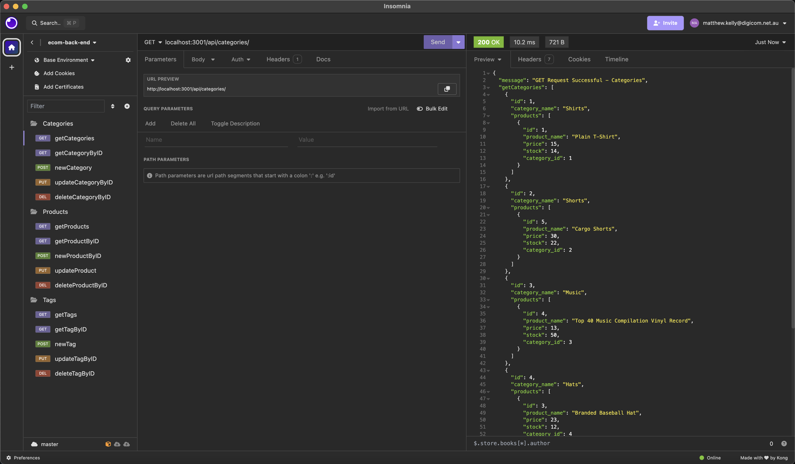
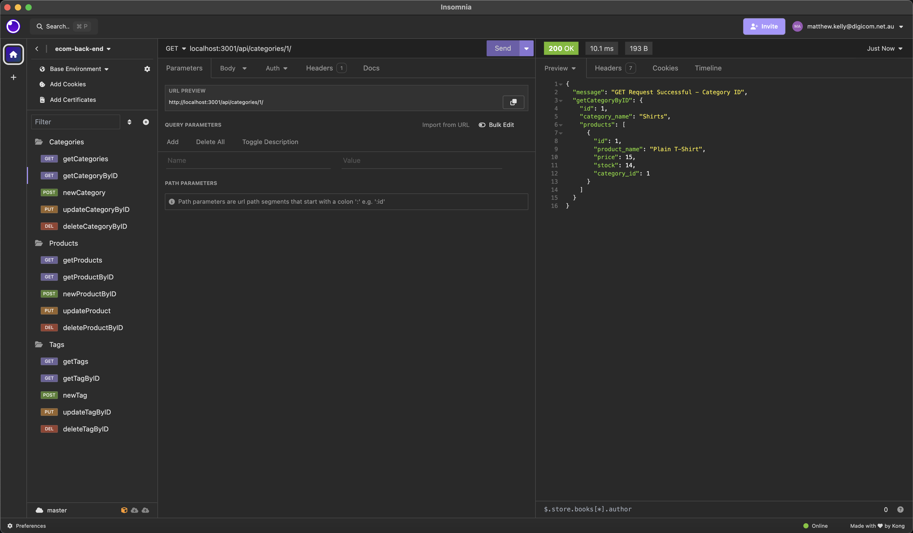
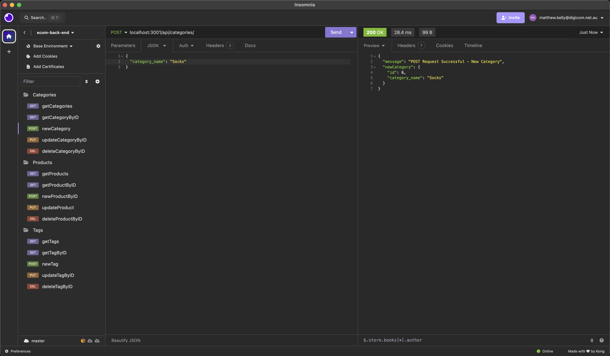

# E-Commerce Back End

## Description

Power the success of your E-Commerce application with this back end API built with Express.js, Sequelize and MySQL.

## Table of Contents

- [Description](#description)
- [Installation](#installation)
- [Usage](#usage)
- [Contribution](#contribution)
- [Tests](#tests)
- [License](#license)
- [Questions](#questions)

## Installation Instructions

To install this application, clone this repository to your local machine and install all relevant packages by executing **'npm install'**. Please note, Node.js must be installed on your local machine for this application to run.

## Usage

To view a live demonstation of this application, please visit this [link](https://www.youtube.com/watch?v=kaXNVYw36Us/). Before running this application locally, create a .env file inside the root directory and add your MySQL credentials like the following:

**DB_NAME='ecommerce_db'** 
**DB_USER='your_user'** 
**DB_PASSWORD='your_password'**

To setup the 'ecommerce_db' database, first execute **'SOURCE db/schema.sql;'** in your MySQL terminal. Exit the MySQL terminal using the **'exit'** command. To seed the database with initial data, execute **'npm run seed'** or **'node seeds'**. Lastly, start the server by executing **'npm start'** or **'node server.js'**.

Use Insomnia (or your preferred API testing application) to test the CRUD operations for the **'ecommerce_db'** database.

For example: Get all **'ecommerce_db'** categories:

</img>

Get an **'ecommerce_db'** category by its ID:

</img>

Add a new category to **'ecommerce_db'**.

</img>

Routes are setup for users to also update and delete categories, products and tags. View the live demonstration to see the functionality of these routes by visiting this [link](https://www.youtube.com/watch?v=kaXNVYw36Us/).

## Contribution Guidelines

This project was developed by Matt Kelly.

## Tests

There are no tests associated with this project.

## License

This project is not licensed. For more information regarding licences, please visit this link: https://opensource.org/license/

## Questions

Please feel free to contact me via my GitHub or email below for any questions associated with this application:  
GitHub: [mattkellyirl](https://github.com/mattkellyirl)  
Email: mattkellyvisual@gmail.com
